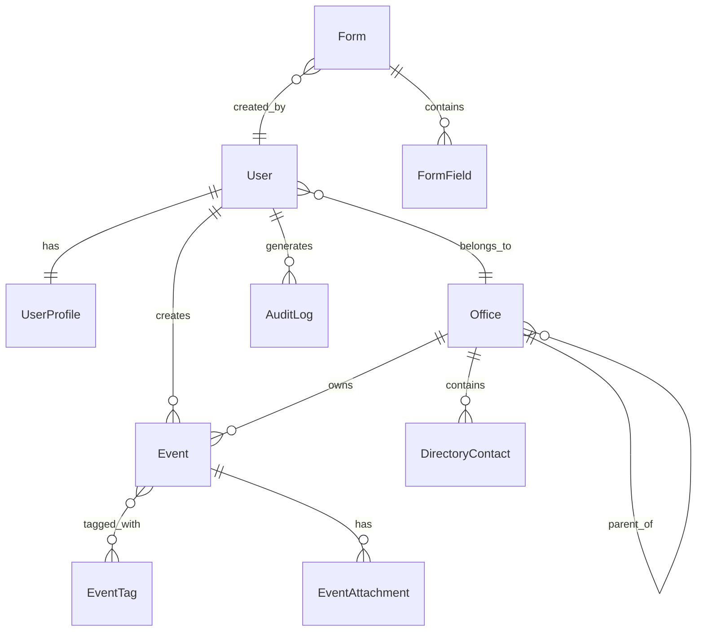

# Design Document

## Overview

The TESDA Calendar Task Management System is a production-ready web application built on Symfony 7/8+ framework that provides a centralized scheduling platform for all TESDA offices. The system implements a shared global calendar architecture where transparency is maintained through universal event visibility, while access control is enforced through a sophisticated Role-Based Access Control (RBAC) system using Symfony Security Voters.

The application follows modern web development practices with a clean separation of concerns, implementing the MVC pattern with Symfony's controller-service-repository architecture. The frontend utilizes Twig templating with Tailwind CSS for responsive design and FullCalendar.js for interactive calendar functionality.

Key architectural principles include:
- **Transparency First**: All users can view all events regardless of role
- **Permission-Based Actions**: Create, edit, and delete operations are role-dependent
- **Conflict Resolution**: Hierarchical override capabilities based on organizational authority
- **Extensibility**: Dynamic form builder and modular component design
- **Security**: Comprehensive protection against common web vulnerabilities

## Architecture

### System Architecture

The system follows a layered architecture pattern:

```
┌─────────────────────────────────────────────────────────────┐
│                    Presentation Layer                       │
│  ┌─────────────┐  ┌─────────────┐  ┌─────────────────────┐  │
│  │    Twig     │  │ Tailwind    │  │   FullCalendar.js   │  │
│  │ Templates   │  │    CSS      │  │                     │  │
│  └─────────────┘  └─────────────┘  └─────────────────────┘  │
└─────────────────────────────────────────────────────────────┘
┌─────────────────────────────────────────────────────────────┐
│                   Application Layer                         │
│  ┌─────────────┐  ┌─────────────┐  ┌─────────────────────┐  │
│  │ Controllers │  │   Voters    │  │      Services       │  │
│  │             │  │  (RBAC)     │  │                     │  │
│  └─────────────┘  └─────────────┘  └─────────────────────┘  │
└─────────────────────────────────────────────────────────────┘
┌─────────────────────────────────────────────────────────────┐
│                    Domain Layer                             │
│  ┌─────────────┐  ┌─────────────┐  ┌─────────────────────┐  │
│  │  Entities   │  │ Repositories│  │   Domain Services   │  │
│  │             │  │             │  │                     │  │
│  └─────────────┘  └─────────────┘  └─────────────────────┘  │
└─────────────────────────────────────────────────────────────┘
┌─────────────────────────────────────────────────────────────┐
│                Infrastructure Layer                         │
│  ┌─────────────┐  ┌─────────────┐  ┌─────────────────────┐  │
│  │   MySQL     │  │  Doctrine   │  │    File System      │  │
│  │  Database   │  │     ORM     │  │                     │  │
│  └─────────────┘  └─────────────┘  └─────────────────────┘  │
└─────────────────────────────────────────────────────────────┘
```

### Security Architecture

The security system implements a multi-layered approach:

1. **Authentication Layer**: Symfony Security component with custom user provider
2. **Authorization Layer**: Role-based permissions with Symfony Voters
3. **Data Protection Layer**: Input validation, CSRF protection, XSS prevention
4. **Audit Layer**: Comprehensive logging of all user actions

### Role Hierarchy

```
Admin (ROLE_ADMIN)
├── Full system access
├── User and office management
├── Form builder access
└── Override all restrictions

OSEC (ROLE_OSEC)
├── View all events
├── Create/edit/delete all events
├── Override scheduling conflicts
└── High-priority scheduling authority

EO (ROLE_EO)
├── View all events
├── Manage own office events only
└── No conflict override

Division (ROLE_DIVISION)
├── View all events
├── Manage assigned office events
└── Read-only for other offices

Province (ROLE_PROVINCE)
├── View all events
├── Create/edit/delete own events only
└── Basic access level
```

## Components and Interfaces

### Core Components

#### 1. Authentication System
- **UserController**: Handles login, registration, password reset
- **SecurityService**: Manages authentication logic and token generation
- **UserProvider**: Custom user provider for Symfony Security
- **AuthenticationListener**: Handles post-authentication events

#### 2. Authorization System
- **EventVoter**: Determines event access permissions
- **UserVoter**: Controls user management permissions
- **OfficeVoter**: Manages office-related permissions
- **DirectoryVoter**: Controls directory access
- **FormBuilderVoter**: Manages form builder permissions

#### 3. Calendar System
- **CalendarController**: Main calendar interface and API endpoints
- **EventController**: Event CRUD operations
- **EventService**: Business logic for event management
- **ConflictResolver**: Handles scheduling conflicts based on roles
- **RecurrenceService**: Manages recurring event patterns

#### 4. Profile Management
- **ProfileController**: User profile CRUD operations
- **ProfileService**: Profile validation and completion checking
- **AvatarService**: Avatar upload and management

#### 5. Directory System
- **DirectoryController**: Contact and office management
- **DirectoryService**: Directory business logic
- **ContactRepository**: Database operations for contacts

#### 6. Form Builder System
- **FormBuilderController**: Dynamic form creation interface
- **FormBuilderService**: Form schema management
- **FormRenderer**: Dynamic form rendering from JSON schema
- **FieldTypeRegistry**: Registry of available field types

### Interface Definitions

#### EventServiceInterface
```php
interface EventServiceInterface
{
    public function createEvent(array $eventData, User $user): Event;
    public function updateEvent(Event $event, array $eventData, User $user): Event;
    public function deleteEvent(Event $event, User $user): bool;
    public function checkConflicts(DateTime $start, DateTime $end, ?Event $excludeEvent = null): array;
    public function canOverrideConflict(User $user): bool;
    public function getEventsForUser(User $user, DateTime $start, DateTime $end): array;
}
```

#### ConflictResolverInterface
```php
interface ConflictResolverInterface
{
    public function resolveConflict(Event $newEvent, array $conflictingEvents, User $user): ConflictResolution;
    public function canUserOverride(User $user, Event $conflictingEvent): bool;
    public function getConflictWarning(array $conflicts): string;
}
```

#### FormBuilderServiceInterface
```php
interface FormBuilderServiceInterface
{
    public function createForm(array $schema, string $name, User $user): Form;
    public function renderForm(Form $form): string;
    public function validateFormData(Form $form, array $data): ValidationResult;
    public function getAvailableFieldTypes(): array;
}
```

### API Endpoints

#### Calendar API
- `GET /api/events` - Retrieve events for calendar view
- `POST /api/events` - Create new event
- `PUT /api/events/{id}` - Update existing event
- `DELETE /api/events/{id}` - Delete event
- `GET /api/events/{id}/conflicts` - Check for scheduling conflicts

#### User Management API
- `GET /api/users` - List users (Admin only)
- `POST /api/users` - Create user (Admin only)
- `PUT /api/users/{id}` - Update user (Admin only)
- `DELETE /api/users/{id}` - Delete user (Admin only)

#### Directory API
- `GET /api/directory/offices` - List offices
- `GET /api/directory/contacts` - List contacts
- `POST /api/directory/contacts` - Create contact (Admin only)
- `PUT /api/directory/contacts/{id}` - Update contact (Admin only)

## Data Models

### Core Entities

#### User Entity
```php
class User implements UserInterface
{
    private int $id;
    private string $email;
    private string $password;
    private array $roles;
    private bool $isVerified;
    private ?DateTime $lastLogin;
    private UserProfile $profile;
    private Office $office;
    private Collection $events;
    private Collection $auditLogs;
    
    // Relationships
    // OneToOne: UserProfile
    // ManyToOne: Office
    // OneToMany: Event (as creator)
    // OneToMany: AuditLog
}
```

#### Event Entity
```php
class Event
{
    private int $id;
    private string $title;
    private DateTime $startTime;
    private DateTime $endTime;
    private ?string $description;
    private ?string $location;
    private string $color;
    private bool $isRecurring;
    private ?array $recurrencePattern;
    private User $creator;
    private Office $office;
    private Collection $tags;
    private Collection $attachments;
    private DateTime $createdAt;
    private DateTime $updatedAt;
    
    // Relationships
    // ManyToOne: User (creator)
    // ManyToOne: Office
    // ManyToMany: EventTag
    // OneToMany: EventAttachment
}
```

#### Office Entity
```php
class Office
{
    private int $id;
    private string $name;
    private string $code;
    private string $color;
    private ?string $description;
    private ?Office $parent;
    private Collection $children;
    private Collection $users;
    private Collection $events;
    private Collection $directoryContacts;
    
    // Relationships
    // ManyToOne: Office (parent)
    // OneToMany: Office (children)
    // OneToMany: User
    // OneToMany: Event
    // OneToMany: DirectoryContact
}
```

#### UserProfile Entity
```php
class UserProfile
{
    private int $id;
    private string $firstName;
    private string $lastName;
    private ?string $middleName;
    private ?string $phone;
    private ?string $address;
    private ?string $avatar;
    private bool $isComplete;
    private User $user;
    private DateTime $createdAt;
    private DateTime $updatedAt;
    
    // Relationships
    // OneToOne: User
}
```

#### Form Entity
```php
class Form
{
    private int $id;
    private string $name;
    private string $slug;
    private array $schema; // JSON schema
    private array $tags;
    private bool $isActive;
    private User $creator;
    private Collection $fields;
    private DateTime $createdAt;
    private DateTime $updatedAt;
    
    // Relationships
    // ManyToOne: User (creator)
    // OneToMany: FormField
}
```

#### DirectoryContact Entity
```php
class DirectoryContact
{
    private int $id;
    private string $name;
    private string $position;
    private string $email;
    private ?string $phone;
    private ?string $address;
    private Office $office;
    private DateTime $createdAt;
    private DateTime $updatedAt;
    
    // Relationships
    // ManyToOne: Office
}
```

### Database Relationships



## Error Handling

### Exception Hierarchy

```php
// Base application exception
abstract class TesdaCalendarException extends Exception {}

// Authentication exceptions
class AuthenticationException extends TesdaCalendarException {}
class InvalidCredentialsException extends AuthenticationException {}
class AccountNotVerifiedException extends AuthenticationException {}

// Authorization exceptions
class AuthorizationException extends TesdaCalendarException {}
class InsufficientPermissionsException extends AuthorizationException {}
class ResourceAccessDeniedException extends AuthorizationException {}

// Business logic exceptions
class BusinessLogicException extends TesdaCalendarException {}
class SchedulingConflictException extends BusinessLogicException {}
class InvalidEventDataException extends BusinessLogicException {}
class ProfileIncompleteException extends BusinessLogicException {}

// Data exceptions
class DataException extends TesdaCalendarException {}
class EntityNotFoundException extends DataException {}
class ValidationException extends DataException {}
```

### Error Response Format

```json
{
    "error": {
        "code": "SCHEDULING_CONFLICT",
        "message": "The selected time slot conflicts with existing events",
        "details": {
            "conflicting_events": [
                {
                    "id": 123,
                    "title": "Board Meeting",
                    "start_time": "2024-01-15T10:00:00Z",
                    "end_time": "2024-01-15T12:00:00Z"
                }
            ],
            "can_override": true
        },
        "timestamp": "2024-01-15T08:30:00Z"
    }
}
```

### Global Exception Handler

The system implements a global exception handler that:
- Logs all exceptions with appropriate severity levels
- Returns user-friendly error messages
- Maintains security by not exposing sensitive information
- Provides different error responses for API vs web requests
- Implements proper HTTP status codes

## Testing Strategy

The testing strategy implements a dual approach combining unit tests for specific scenarios and property-based tests for comprehensive validation of universal properties.

### Unit Testing Approach

Unit tests focus on:
- **Specific Examples**: Concrete scenarios that demonstrate correct behavior
- **Edge Cases**: Boundary conditions and special cases
- **Error Conditions**: Exception handling and validation failures
- **Integration Points**: Component interactions and API contracts

### Property-Based Testing Approach

Property-based tests validate universal properties across randomized inputs:
- **Minimum 100 iterations** per property test to ensure comprehensive coverage
- **Randomized test data** generation for events, users, offices, and forms
- **Universal property validation** that must hold for all valid inputs
- **Symfony PHPUnit integration** with custom property test base classes

### Testing Configuration

- **Framework**: PHPUnit with Symfony Test Framework
- **Property Testing Library**: Eris (PHP property-based testing library)
- **Database**: SQLite in-memory for fast test execution
- **Fixtures**: Doctrine Fixtures for consistent test data
- **Mocking**: Prophecy for service mocking and isolation

### Test Organization

```
tests/
├── Unit/
│   ├── Controller/
│   ├── Service/
│   ├── Entity/
│   └── Voter/
├── Integration/
│   ├── Repository/
│   ├── API/
│   └── Security/
├── Property/
│   ├── EventManagement/
│   ├── UserPermissions/
│   └── FormBuilder/
└── Functional/
    ├── Authentication/
    ├── Calendar/
    └── Dashboard/
```

Each property-based test includes a comment tag referencing its corresponding design property:
```php
/**
 * @test
 * Feature: tesda-calendar-system, Property 1: Event visibility consistency
 */
public function testEventVisibilityForAllUsers(): void
{
    // Property test implementation
}
```

## Correctness Properties

*A property is a characteristic or behavior that should hold true across all valid executions of a system—essentially, a formal statement about what the system should do. Properties serve as the bridge between human-readable specifications and machine-verifiable correctness guarantees.*

### Property 1: Authentication Security Consistency
*For any* user attempting to access the system, authentication must be validated using secure credentials, failed attempts must be rate-limited, and passwords must be stored using approved hashing algorithms (bcrypt/argon2id)
**Validates: Requirements 1.1, 1.4, 1.5**

### Property 2: Email Verification Round Trip
*For any* user registration, the account must remain unverified until email verification is completed, and password reset tokens must expire after their designated time period
**Validates: Requirements 1.2, 1.3**

### Property 3: Role-Based Permission Enforcement
*For any* authenticated user, their assigned role (Admin, OSEC, EO, Division, Province) must consistently determine their access permissions across all system features, with Admin having full access, OSEC having event override capabilities, and other roles having progressively restricted permissions
**Validates: Requirements 2.1, 2.2, 2.3, 2.4, 2.5, 2.7**

### Property 4: Profile Completion Gate
*For any* user with an incomplete profile, access to main system features must be prevented until all required fields (name, office assignment, role, contact details, avatar) are completed and validated
**Validates: Requirements 3.1, 3.2, 3.3, 3.5**

### Property 5: Universal Event Visibility
*For any* authenticated user regardless of role, all events in the system must be visible, color-coded by office assignment, with consistent color legend display and proper ownership tracking
**Validates: Requirements 4.1, 4.2, 4.4, 4.7**

### Property 6: Event Search and Filtering Consistency
*For any* search query or filter criteria, the results must be relevant, properly formatted with tooltips, and maintain chronological ordering for upcoming events
**Validates: Requirements 4.5, 4.6, 9.3**

### Property 7: Scheduling Conflict Resolution
*For any* event creation attempt, conflicts must be detected and handled according to user role: normal users (EO, Division, Province) must be blocked with error messages, while privileged users (OSEC, Admin) must receive override confirmation options
**Validates: Requirements 5.1, 5.2, 5.3**

### Property 8: Event Data Integrity
*For any* event operation (create, update, delete), all event fields (title, start/end time, location, description, tags, office, color, attachments) must be validated, and drag-and-drop or resize operations must correctly update event timing
**Validates: Requirements 5.4, 5.5, 5.6, 5.9**

### Property 9: Recurring Event Pattern Consistency
*For any* recurring event pattern, the generated event instances must follow the specified recurrence rules and integrate properly with holiday displays
**Validates: Requirements 5.7, 5.8**

### Property 10: Office Color Uniqueness
*For any* office in the system, it must have a unique color assignment that is consistently used for all its events, with no color conflicts between offices, and proper legend display
**Validates: Requirements 6.1, 6.2, 6.3, 6.4, 6.5**

### Property 11: Admin-Only Directory Access
*For any* directory management operation (CRUD on offices, contacts, phone numbers, emails, addresses), only Admin users must have access, with full audit logging of all changes and proper data validation
**Validates: Requirements 7.1, 7.2, 7.3, 7.4**

### Property 12: Form Builder Schema Consistency
*For any* form created through the Form Builder, it must support all specified field types (text, textarea, date, time, select, checkbox, file upload), store schema as valid JSON, support tagging and assignment, and render dynamically from stored schema
**Validates: Requirements 8.2, 8.3, 8.4, 8.5, 8.6**

### Property 13: Dashboard Content Completeness
*For any* user accessing the dashboard, it must display today's schedule, upcoming events in chronological order, relevant notifications, and redirect incomplete profiles to profile completion
**Validates: Requirements 9.2, 9.5, 9.6**

### Property 14: Comprehensive Security Protection
*For any* user input or system interaction, CSRF protection must be implemented on forms, XSS attacks must be prevented through proper sanitization, file uploads must be validated for type and size restrictions, and all user actions must be logged for audit purposes
**Validates: Requirements 10.1, 10.2, 10.4, 10.5, 10.6, 10.8**

### Property 15: Database Seeding Consistency
*For any* database seeding operation, it must create all expected initial data including default offices, roles, and system configurations in a consistent and repeatable manner
**Validates: Requirements 11.6**

### Property 16: Responsive Interface Consistency
*For any* screen size or device, the interface must remain functional and provide clear visual feedback for user actions, with proper navigation elements (sidebar and top navbar) accessible
**Validates: Requirements 12.5, 12.6**

### Property 17: API Consistency and Security
*For any* API endpoint, it must require proper authentication and authorization, return consistent JSON responses with appropriate HTTP status codes, implement rate limiting, support pagination for large datasets, and validate inputs with meaningful error messages
**Validates: Requirements 13.1, 13.2, 13.3, 13.4, 13.6, 13.7**